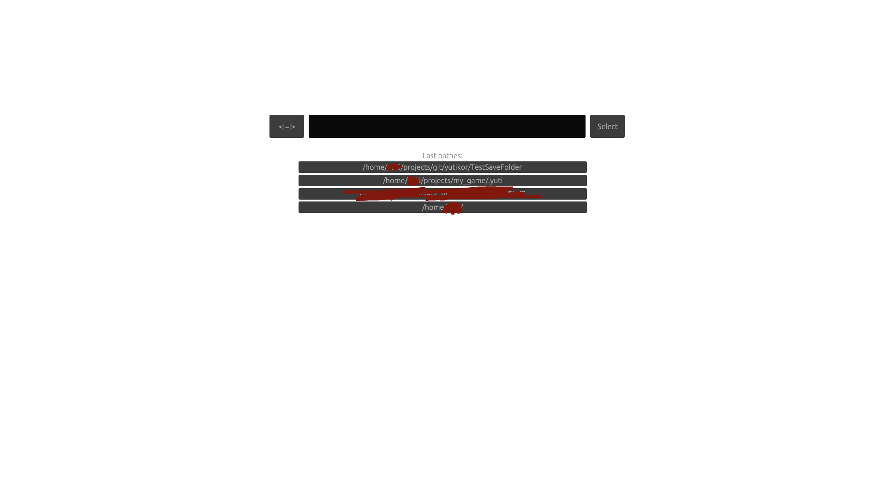
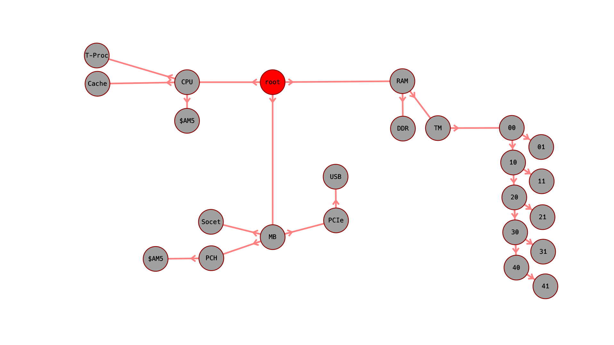
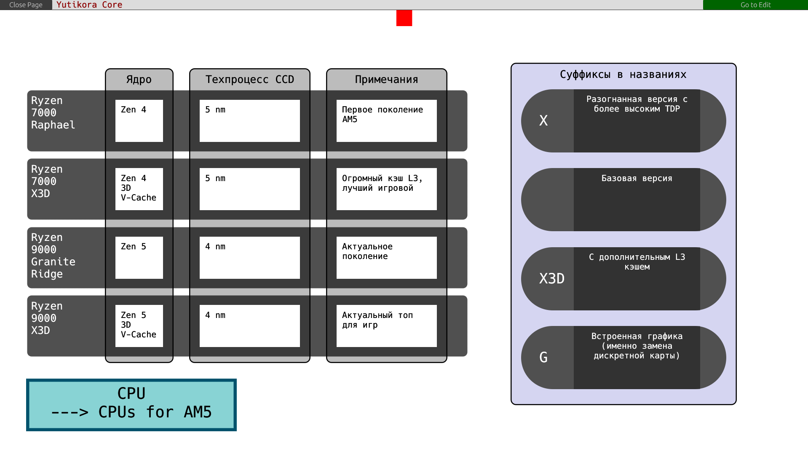
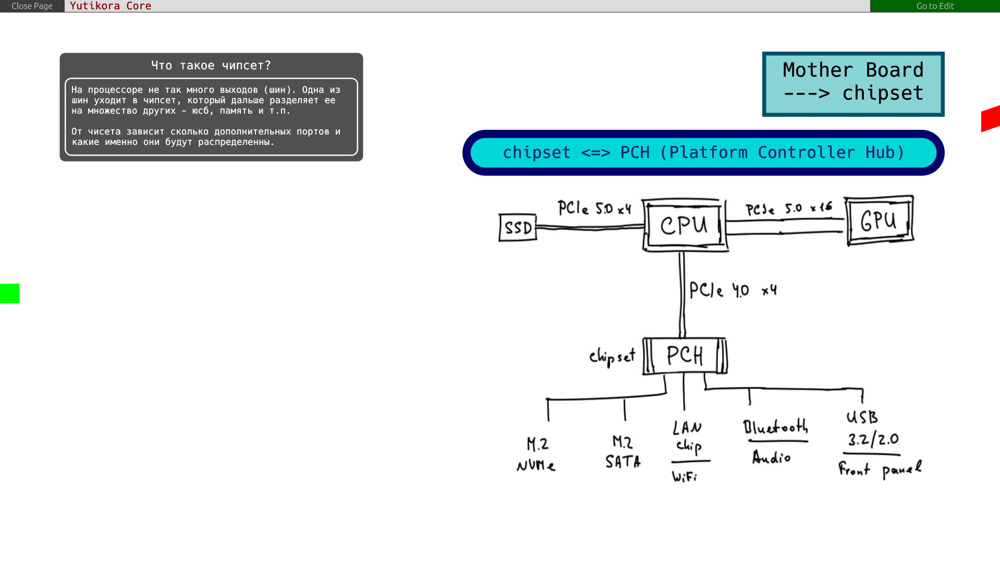
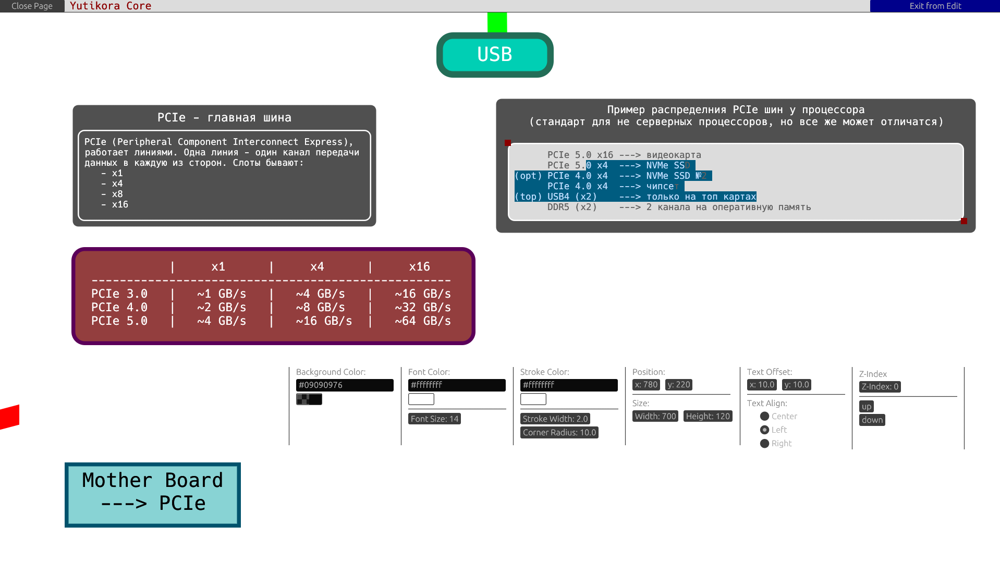

# Yutikor

**Yutikor** is a graphical editor for taking notes. How it works:

1. Open the desired folder in the application menu. *(This will create files directly in that folder. If you want to store notes, for example, in your `~/projects/my-best-project/...` folder, to avoid cluttering it, I recommend creating a folder and choosing `~/projects/my-best-project/.yuti/`. This way, the program will save its files neatly in a hidden folder.)*
2. You will then be taken to the graph menu with the main node. From there, you can create subgraphs.
3. Clicking on each graph node will take you to its workspace.
4. You can navigate between adjacent graphs by clicking the arrows on the edges of the screen. The red arrow is the parent graph, and the green arrows are the child graphs.

## What does it look like?

**! THIS IS AN EXAMPLE OF FINISHED PAGES I CREATED FOR PERSONAL PURPOSES !**

**! THE PURPOSE OF THESE SCREENSHOTS IS TO DEMONSTRATE THE PROGRAM'S CAPABILITIES ONLY !**


| Folder-Select Menu | Graph |
|----------|----------|
|  |  |

| Example Page 1 | Example Page 2 | Example Page 3 |
|----|----|----|
|  |  | 

***Note:** you can see full images [hier](assets/).*

## How to install

### Requieremets
- `Rust`
- `Linux` with `X11 or Wayland` *(This version also works on `Windows 10 & 11`, but requires additional installation of Visual Studio C++)*

### Build from source
1. Install `git` and `rust`; 
2. Clone repository : `git clone https://github.com/Xhelgi/yutikor`;
3. Go into downloaded folder : `cd yutikor`;
4. Build with cargo : `cargo build --release`;
5. Run the file : `./target/release/yutikor`;
``` Bash
# The binary will be aviable at target/release/yutikor
```

## Build with:
- `rust`
- `eframe`
- `serde`
- `serde-json`
- `dirs`
- `image`
- `rfd`

*Thanks to the creators of these crates for the excellent functionality and documentation.*

## AI Usage
This project **was created entirely by hand**. In a few cases, AI was used to quickly generate the function structure or code-refactor under time constraints - these commits are clearly marked in the commit history. In such cases, the generated code will be completely rewritten in the future.

## License
Distributed under the GPL-3.0 License. See [LICENSE](LICENSE) for more information.